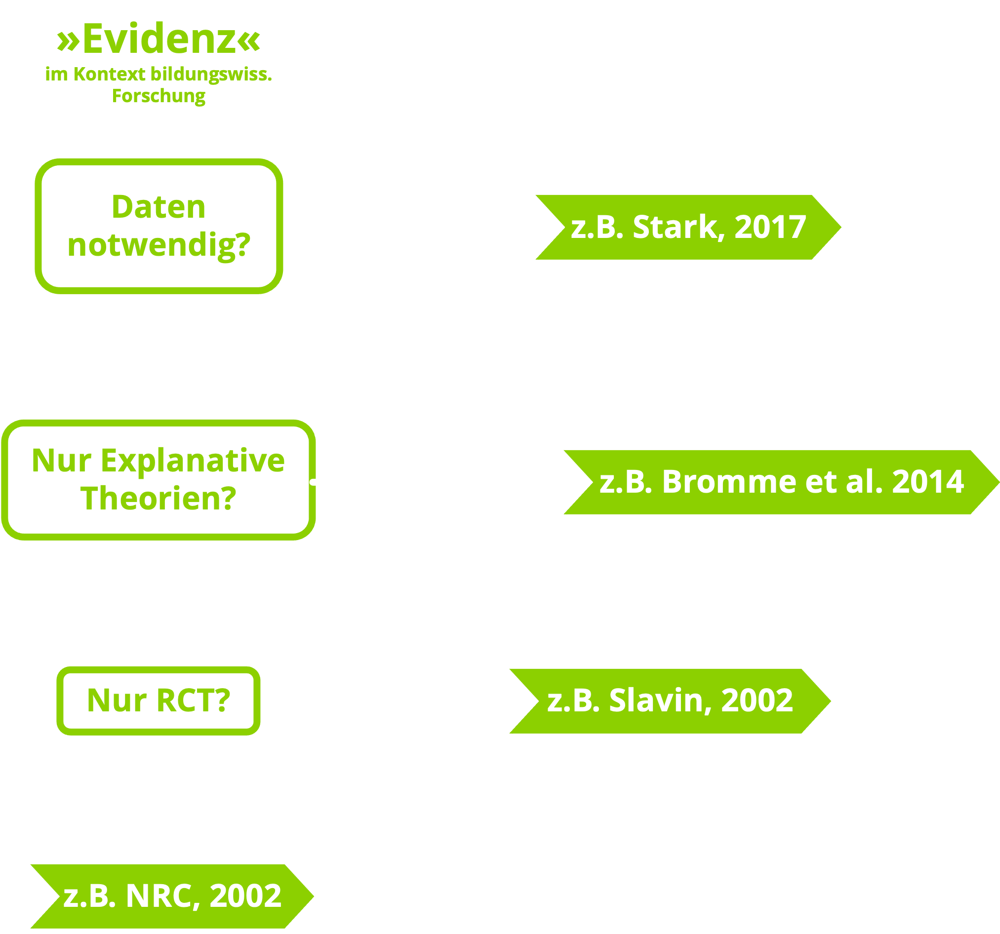
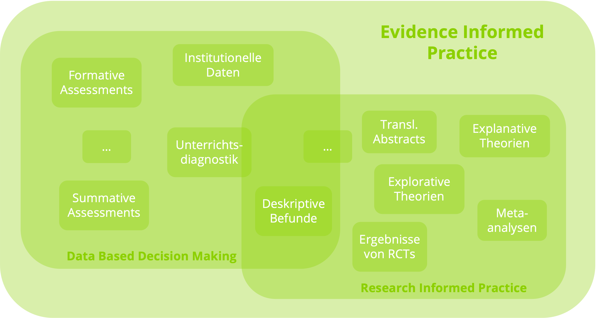
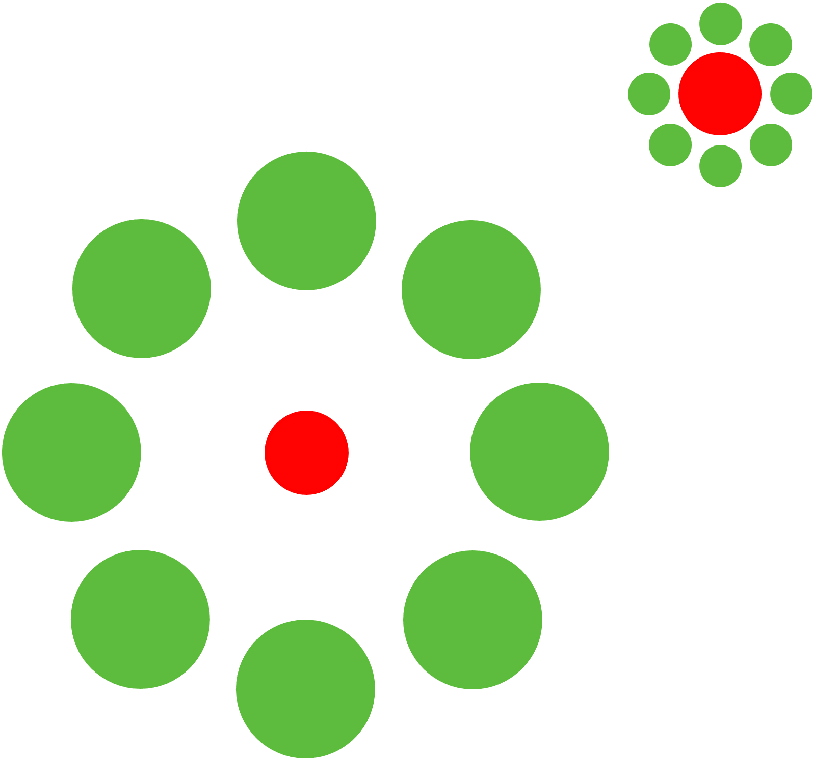
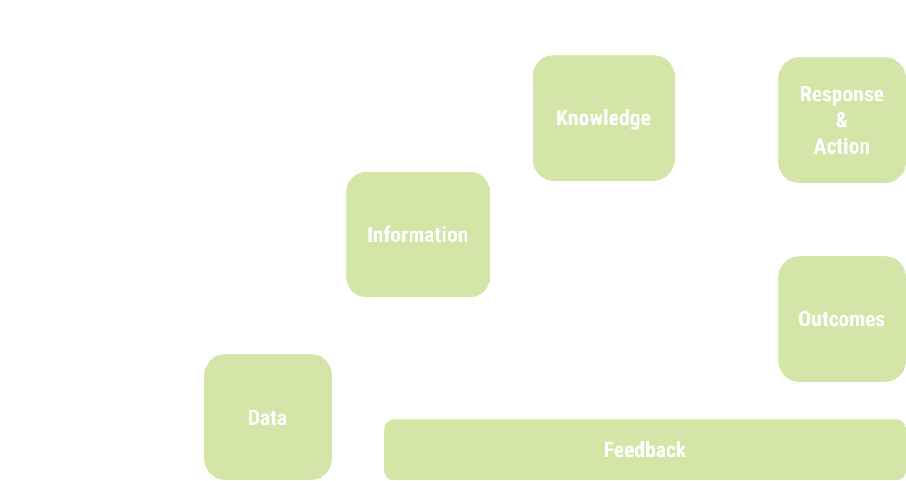
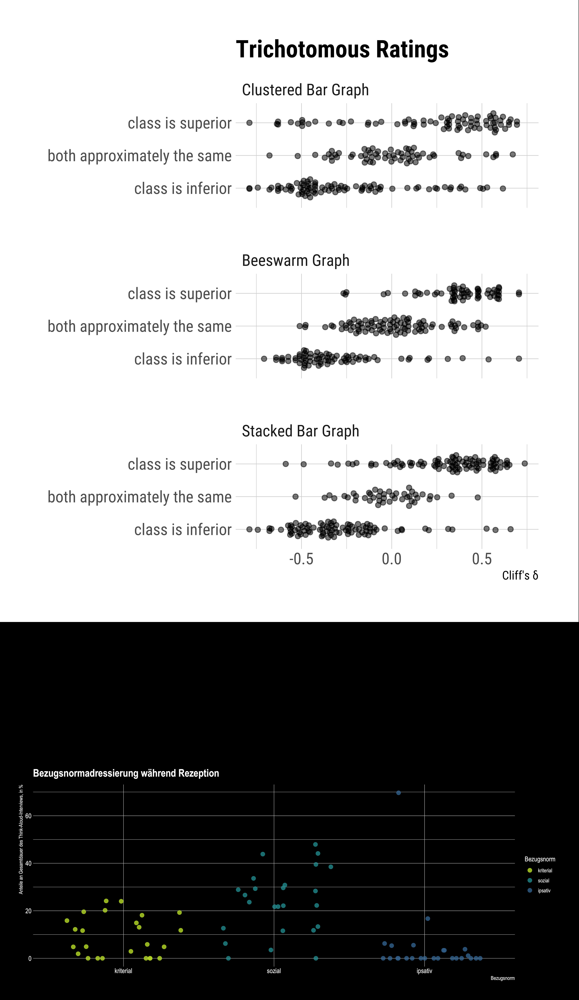
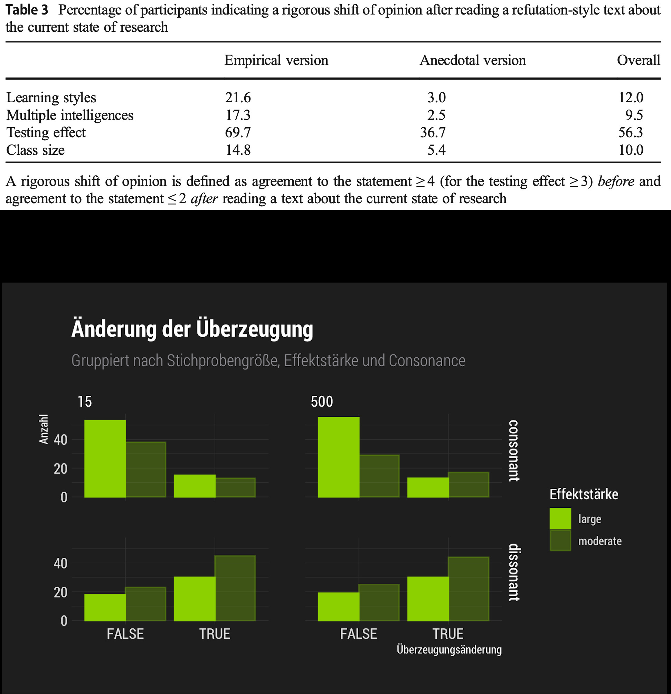
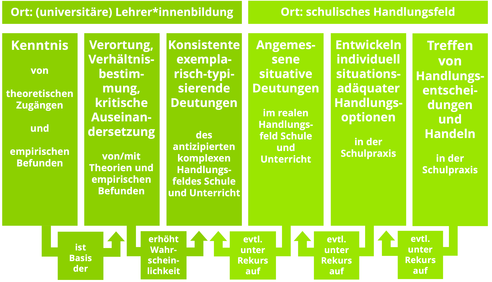

class: hide_logo center middle
<script src="https://kit.fontawesome.com/994a28441d.js" crossorigin="anonymous"></script>
```{r setup, include=FALSE}
options(htmltools.dir.version = FALSE,
        htmltools.preserve.raw = FALSE)
knitr::opts_chunk$set(
  fig.width=9, fig.height=3.5, fig.retina=3,
  out.width = "100%",
  cache = FALSE,
  echo = TRUE,
  message = FALSE, 
  warning = FALSE,
  hiline = TRUE
)
```

```{r, echo = F}
library(xaringanthemer)

extra_css <- 
  list(
    ".cit"  = list("font-size" = "70%",
                   "color" = "#8cd000"),
    ".phg" = list("color" = "#8cd000"),
    ".em05" = list("font-size" ="0.5em"),
    ".em06" = list("font-size" ="0.6em"),
    ".em07" = list("font-size" ="0.7em"),
    ".em08" = list("font-size" ="0.8em"),
    ".em09" = list("font-size" ="0.9em"),
    ".em11" = list("font-size" ="1.1em"),
    ".em12" = list("font-size" ="1.2em"),
    ".em13" = list("font-size" ="1.3em"),
    ".em14" = list("font-size" ="1.4em"),
    ".em15" = list("font-size" ="1.5em"))

style_mono_accent_inverse(
  base_color = "#8cd000",
  white_color = "#FFFFFF",
  black_color = "#272822",
  extra_css = extra_css)

library(xaringanExtra)
use_logo(
  image_url = "https://svgshare.com/i/bQV.svg",
  width = "80px",
  position = xaringanExtra::css_position(top = "1em", right = "1em")
)
```


.phg[
# Evidenzbasierte Lehrerinnen- und Lehrerbildung?

<i class="fas fa-balance-scale-left fa-6x"></i>

### Von Chancen, Risiken und Nebenwirkungen.
---  
.em14[Samuel Merk | PH Karlsruhe]]  


---
class: middle center
# Überblick

--
### <i class="fas fa-bullseye"></i> Zum Begriff »Evidenz«

--
### <i class="fas fa-balance-scale-left"></i> Chancen

--
### <i class="fas fa-balance-scale-right"></i> Risiken 

--
### <i class="fas fa-map-signs"></i> Nebenwirkungen & Resümee

???
evtl. Icons statt Bulletpoints

---
class: middle center inverse hide_logo
# <i class="fas fa-bullseye"></i>  Zum Begriff »Evidenz«

---
## Etymologie: »Evidenz«
* Ableitung vom Adjektiv _»evident«_ .cit[(Kluge, 2011, S.263)] 
* _»evident«_ wurde im 18 Jhd. aus dem lateinischen Adjektiv _»evidens«_,  .cit[(»ersichtlich, augenscheinlich«; Test)] entlehnt.
* _»evidens«_ wiederum entstammt dem Verb _»videre«_ .cit[(»sehen«, TEST)]


--
.pull-left[
### Verwendung: »Evidenz«
* _»evidence«_ meint im Englischen _»Nachweis, Beweis, Beleg«_ .cit[(TEST)]
* _»Evidenz«_ meint jedoch .cit[(Duden, TEST)]
    * unmittelbare Einsichtigkeit oder
    * faktische Gegebenheit oder
    * Ablage oder
    * »empirisch erbrachter Nachweis der Wirksamkeit eines Präparats, einer Therapieform o. Ä.« 
]

.pull-right[
### Häufigkeit: »Evidenz«
```{r, echo = F, fig.height=5}
library(tidyverse)
data_verwendung_evidenz <- 
   tibble(
     `»Evidenz«` = c(
       0.0822948823548123, 0.0864467101602001, 0.113276959546673, 0.13999394840173,
       0.13573359293446, 0.131708932942091, 0.136861672940761, 0.143452484680887, 
       0.142279076479901, 0.106932189840039, 0.0704499451924082, 0.0633145580863124,
       0.0519896417532422, 0.0663484052171933, 0.070728948180559, 0.0837050966314184,
       0.12482506771421, 0.15745974497631, 0.221482693322517, 0.234665378078507,
       0.23924913470157, 0.299418506561544, 0.311640974850378, 0.285112938063258, 
       0.270603910337625, 0.246680623082617, 0.279969245129795, 0.257019732363425,
       0.205722519060645, 0.191750950885163, 0.216231350874723, 0.220777302778072, 
       0.227080058161387, 0.228657273320447, 0.254382492323234, 0.274430462702841,
       0.275969336775004, 0.265934421908756, 0.26687994658747, 0.310328032561805, 
       0.311797466701208, 0.339732373142935, 0.343005847844141, 0.372911781205623,
       0.424608470085374, 0.468843296452663, 0.463202162689663, 0.468726961484799, 
       0.467778757575889, 0.522851471492953, 0.576123784456921, 0.617487668617142, 
       0.663304687022645, 0.701862901064268, 0.735968415204076, 0.765031136080774,
       0.801908091702316, 0.813333638194281, 0.800945564994825, 0.792230464532756,
       0.779424751119589, 0.781896151808327, 0.78483707262466, 0.751986709794611, 
       0.743756523074073, 0.775033071799381, 0.763696179101889, 0.742703859348818,
       0.752610947977049, 0.851857796272815, 1.00293422376183, 1.29230277283723, 
       1.73459240137247, 1.90698463274771, 2.16382418991153, 2.5072030372292 ),
     X = 1946:2021,
     `»evidenzbasiert«` = 
       c(0, 0, 0, 0, 0, 0, 0, 0, 0, 0, 0, 0, 0, 0, 0, 0, 0, 0, 0, 0, 0, 0, 0, 
           0, 0, 0, 0, 0, 0, 0, 0, 0, 0, 0, 0, 0, 0, 0, 0, 0, 0, 0, 0, 0, 0, 0, 
           0, 0, 0, 0.0112025415733449, 0.0181766029628592, 0.0257290561046502,
           0.0344309501547322, 0.051792022459627, 0.0732368796153364, 
           0.0906637532964253, 0.105562901199919, 0.126556340153599, 
           0.153288236780401, 0.189563107845902, 0.226083351505016, 
           0.250985870222063, 0.283785580649933, 0.301511433337405, 
           0.335277426785241, 0.388381383618801, 0.408261921131379, 
           0.419872079149944, 0.460371824226692, 0.516206220292182, 
           0.577488114394082, 0.644987122530188, 0.762533660651294, 
           0.813955751026988, 0.885058837656782, 0.954341085409344)
   ) %>% 
  gather(var, val, -X)

library(hrbrthemes)
ggplot(data_verwendung_evidenz,
       aes(X, val)) + 
  geom_point(color = "#8cd000") + 
  facet_wrap(~var, ncol = 2, scales = "free") +
  geom_smooth(color = "#8cd00035", se = F) +
  theme_modern_rc() +
  ggtitle("Frequenz »Evidenz« und »evidenzbasiert«", 
          "im DWDS Zeitungskorpus") +
  labs(caption = "Daten: DWDS – Digitales Wörterbuch der deutschen Sprache.\nBerlin-Brandenburgischen Akademie der Wissenschaften, abgerufen am 31.10.2021.") + 
  xlab("") +
  ylab("Häufigkeit pro 1 Mio. Tokens") +
  theme(strip.text = element_text(color = "white"))
```


]
???
DesignIdee: TimeVis


???
Das Problem der (wörtlichen) Übersetzung bzw. der di- rekten Übernahme des Evidenzbegriffs aus dem Engli- schen ist Befürworterinnen und Befürwortern (z. B. Brom- me et al., 2014) wie Kritikerinnen und Kritikern (Bellmann & Müller, 2011; Sandkühler, 2011) evidenzbasierter Päda- gogik bewusst, die Bewertung dieses begrifflichen Prob- lems und die hieraus gezogenen Konsequenzen fallen je- doch sehr unterschiedlich aus (vgl. hierzu auch Thompson, 2014). Der Mainstream der empirischen Bildungsfor- schung und insbesondere Vertreterinnen und Vertreter der Pädagogischen Psychologie begnügen sich damit, das Problem – wenn überhaupt – zu konstatieren (z. B. Bromme
et al., 2014). Diese Position, die sich traditionell wissen- schaftshistorischer und -theoretischer Reflexionen weit- gehend enthält, wird von erziehungswissenschaftlicher und philosophischer Seite scharf kritisiert (Bellmann & Müller, 2011). Für die Kritikerinnen und Kritiker bildet die begriffliche Problematik den Ausgangspunkt für tief ge- hende erkenntnistheoretische Analysen und die Entwick- lung einer umfassenden Kritik am Vorhaben einer evi- denzbasierten pädagogischen Praxis.

---
## »Evidenz« im Kontext bildungswiss. Forschung
.pull-left[
> _[...] wird Evidenz – abweichend von Konzeptionen evidenzbasierter Medizin – pragmatisch im Sinn von „wissenschaftlichem Wissen“ verwendet._  .cit[(Stark, 2017)]

&nbsp;

> _Wenn [...] Daten dazu dienen, Vermutungen, Hypothesen oder Theorien zu stützen – oder zu widerlegen – erhalten sie die Funktion von „Evidenz“._ .cit[(Bromme et al., 2014)] 
]

.pull-right[
```{r, echo = F, out.width="90%"}

```
]

???
Auf der vorigen Folie hab ich versucht deutlich zu machen, dass die alltagssprachliche Verwendung des Begriffs Evidenz recht heterogen ist - insbesondere durch die Übernahme des Begriffs aus dem Englischen.  
Allerdings wird er Begriff der »Evidenz« auch im bildungswiss. Kontext ...

---
???
Wenn der »Evidenz«-Begriff - wie auf der vorherigen Folie dargestellt - Wissenschafts- oder Erkenntnistheoretisch unterschiedlich verwendet wird - ist es nur logisch, dass auch daraus abgeleitete Begriffe, Komposita etc. recht unterschiedlich konnotiert sind.

---
class: center middle
```{r, echo = F, out.width="85%", fig.cap='Nach Brown, Schilkamp und Hubers, <span style="color:#8cd000"> (2017) </span>. Eigene Darstellung.'}

```

???
Um etwas Struktur in diese unterschiedlichen Konnotation zu bekommen möchte ich für den Rest des Vortrags unter »evidenzbasiert« sowohl das subsumieren was Chris Brown ...

---
class: middle center inverse hide_logo
# <i class="fas fa-balance-scale-left"></i> Chancen und  Risiken 

---
## Risiko I: (Über-)Technisierung von Bildungsprozessen
* Das Technologieproblem in der Erziehungswissenschaft
    * Hat eine Lange Tradition <span style="color:#8cd000; font-size:70%"> (Tenorth, 2006)(Hollstein, 2011) </span>
    * »Strengere« und »mildere« Positionen nach wie vor präsent <span style="color:#8cd000; font-size:70%"> (Hollstein, 2011) </span>
&nbsp;  
&nbsp;  

--

> Eine »evidenzbasierte Lehrerbildung« birgt (unabhängig von der Auslegung des Evidenzbegriffs) das Risiko »Technologiefantasien« zu induzieren, nach dem Motto Professionalität ist durch die Kenntnis einer hinreichenden Menge von Sätzen der Art __"Wenn C, dann A ⟹ B"__ gegeben.

&nbsp;  

--

<i class="fas fa-microscope fa-3x text-info" style="float: left; margin-right:45px; margin-top:25px; color:#8cd000"></i>
* Lehramtsstudierende weisen einen substantiellen Anteil absolutistischer epistemischer Überzeugungen auf .cit[(Merk, 2016)]. 
* Lehramtsstudierende schreiben sowohl explanativen wie auch deskriptiven Theorien mehrheitlich transfer-artige Relationierung zur Praxis zu .cit[(Schneider, Kulcar, & Merk, submitted)]

???
Beispiele aus DBDM (FA?) und EIP (Kounin)
Eine ausführliche Begründung dieses Claims spare ich mir an dieser Stelle, denn es ist mit Blick auf klassische Ansätze der Professionalität oder Probabilistischen Natur oder Grundsätzlichen 


---
## Chance I: Wahrnehmung mit DBDM entzerren
.pull-left[
<center>
```{r, echo=FALSE, fig.cap="Ebbinghaustäuschung<br>(Massaro & Anderson, 1971)", out.width="30%"}

```
</center>
]

.pull-right[
<center>
<video controls="controls" width="350" height="200" name="Video Name">
  <source src="https://apps.samuel-merk.de/data/MBI.mov">
</video><br>
(Kleinman & Anandarajan, 2011)
</center>
]

&nbsp;  

--
> Evidenzbasierung im Sinne eines DBDM hat das Potential die professionelle Wahrnehmung zu entzerren bzw. Verzerrungen zu explizieren.

&nbsp;  


--
<i class="fas fa-microscope fa-3x text-info" style="float: left; margin-right:35px; color:#8cd000"></i> 
[](img/acurracy.png)
* Lehrkräfte können Effektstärken in Rückmeldungen aus Vergleichsarbeiten sehr präzise interpretieren .cit[(Merk, Kelava, & Groß Ophoff, eingereicht)]

---
## Risiko II: Data misuse/abuse/not-use

```{r, echo = F, fig.align='center', fig.cap='<span style="color:#8cd000">(Marsh, 2006)</span>', out.width="30%"}

```


> Evidenzbasierung im Sinne eines DBDM ist __keine hinreichende Bedingung__ für erfolgreiches professionelles Handeln

&nbsp;  

--
<i class="fas fa-microscope fa-3x text-info" style="float: left; margin-right:55px; margin-bottom:35px; margin-top:35px; color:#8cd000"></i> 
[](img/sensitivity_beznorm.png)
* Im Kontext von VERA wenden Lehrkäfte die kriteriale Bezugsnorm kaum an .cit[(Bez, Poindl, Bohl, & Merk, 2021)]
* Lehrkräfte halten selbst moderate Effekte nach .cit[(Cohen, 1988)] für unbedeutsam .cit[(Merk, Kelava, & Groß Ophoff, eingereicht)].

---
## Chance II: Mythen werden falsifizierbar

* Erziehungswissenschaftliche und pädagogisch-psychologische Fehlkonzepte gelten national wie international als verbreitet .cit[(Dekker et al., 2012; Dündar & Gündüz, 2016; Menz et al., 2020)]. Typische Untersuchungsgegenstände sind Fehlkonzepte zu 
    * Lernstilen <span style="color:#8cd000; font-size:70%">(Rogowsky et al., 2015)</span>
    * Testing-Effect <span style="color:#8cd000; font-size:70%">(Rogowsky et al., 2015)</span>
    * Sitzenbleiben <span style="color:#8cd000; font-size:70%">(Thomm et al., 2021)</span> und
    * Klassengrößeneffekte <span style="color:#8cd000; font-size:70%">(Merk et al., 2017)</span>
  
&nbsp;  

--
> Zwischen Überzeugungen und wiss. Theorien bzw. Befunden zu ein und demselben Gegenstand liegt oft eine nicht unerhebliche Diskrepanz vor (»Mythen«). Evidenzbasierung hat das Potential diese Diskrepanz zu verkleinern.

&nbsp;  

--
<i class="fas fa-microscope fa-3x text-info" style="float: left; margin-right:55px;  margin-top:35px; color:#8cd000"></i> 
[](img/change_menz_merk.jpg)
* Obwohl Lehrkfäfte und Lehramtstudierende zu einer starken Aufwertung persönlicher Erfahrung neigen .cit[(Menz et al., 2020)], induziert die Präsentation von Evidenz (stärkere) Änderungen (als die Präsentation episodischer Evidenz) .cit[(Bohrer, Schmidt, & Merk, eingereicht)].

---
## Risiko III: Verrauschte/Verzerrte Rezeption von Forschung 

* Typische Verzerrungen kommen auch bei der Interpretation und Bewertung von Forschungsergebnissen zum tragen. Typische Biases sind
    * Confirmation Bias <span style="color:#8cd000; font-size:70%">(Nickerson, 1998)</span>
    * Anchor Bias <span style="color:#8cd000; font-size:70%">(Tversky & Kahneman, 1974)</span>
    * Hindsight Bias <span style="color:#8cd000; font-size:70%">(Langfeldt, 1989)</span>
    * Positive Testing <span style="color:#8cd000; font-size:70%">(Snyder & Swann, 1978)</span>

&nbsp;  

--
> Die Integration von wiss. Befunden und Theorien in Überzeugungen ist ein komplexer Prozess 

&nbsp;  

--
<i class="fas fa-microscope fa-3x text-info" style="float: left; margin-right:55px; margin-top:25px; margin-bottom:25px; color:#8cd000"></i> 
* Dieselbe Studie wird als von geringer Qualität beurteilt wenn die (vorgeblichen) Ergebnisse der eigenen Überzeugunge widersprechen .cit[(Masnick & Zimmerman, 2009)]
* Bewertung der Stichprobengröße fällt (unabhängig von stat. Power) extrem unterschiedlich aus, je nachdem wie groß eine zuvor erwähnte Stichprobengröße war .cit[(Bohrer, Schmidt, & Merk, eingereicht)].

---
## Chance III: Wissenschaftskommunikation nutzen

* In unserer Informationsgesellschaft findet »Kognitive Arbeitsteilung« .cit[(Bromme & Goldman, 2014)] statt. Dies führt auf Seiten der »Laien« zur Notwendigkeit
   * epistemischen Vertrauens <span style="color:#8cd000; font-size:70%">(Hendriks et al., 2015) </span>
   * epistemischer Wachsamkeit <span style="color:#8cd000; font-size:70%">(Sperber et al., 2010) </span>
   * »second hand evaluation strategies« <span style="color:#8cd000; font-size:70%">(Rosman & Merk, 2021) </span>

&nbsp;  

--
> Die Wissenschaftskommunikationsforschung hat Strategien zur Minimierung von Informationsverlust, verzerrter Wahrnehmung und Skeptizismus entwickelt.

&nbsp;  

--
<i class="fas fa-microscope fa-3x text-info" style="float: left; margin-right:55px; margin-top:65px; margin-bottom:35px; color:#8cd000"></i> 
* Confirmation Bias kann durch »Consider the Opposite Strategien« eingedämmt werden .cit[(Schmidt, Kunina-Habenicht, & Merk, eingereicht)]
* Open Science Practices (Präregistierung, Open Materials, ect) erhöhen epistemisches Vertrauen .cit[(Schneider, Rosman, & Merk, eingereicht)].
* Statistische Information (»Signifikanz«) kann weniger missverständlich formuliert werden .cit[(Schmidt, et al., eingereicht)]

---
class: middle center inverse hide_logo
# Nebenwirkungen & Resümee


---
## Professionalität als Metareflexivität
```{r, echo = F, out.width="70%", fig.align='center', fig.cap="Visualisierung des Modells von Cramer et al. (2019)"}

```

